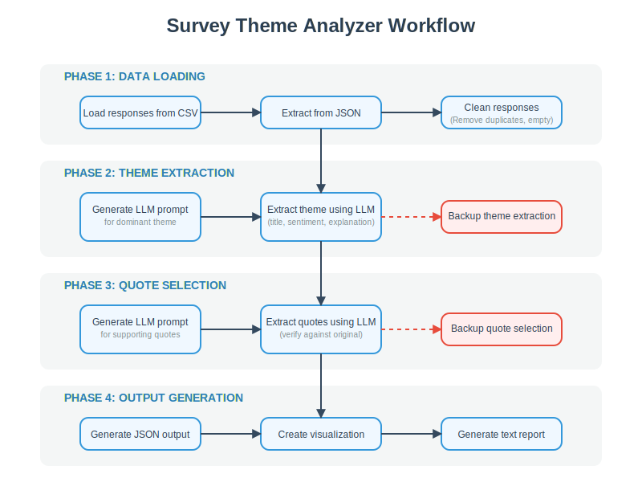

# Survey Theme Analyzer

## Overview

Survey Theme Analyzer is a Python application that processes survey responses to extract the single most dominant theme using AI-powered analysis. The tool uses a locally running Qwen language model to analyze text responses, identify themes, and extract supporting quotes.

## Features

- **AI-Powered Theme Extraction**: Uses Qwen LLM to identify the dominant theme in survey responses
- **Quote Analysis**: Extracts representative quotes that support the identified theme
- **Sentiment Analysis**: Determines sentiment (positive, neutral, negative) for responses
- **Visualization**: Creates visual representations of sentiment distribution and theme information
- **Multiple Output Formats**: Generates JSON data, detailed text reports, and visualizations

## Workflow



1. **Data Loading**: The application loads survey responses from CSV files or extracts them from existing JSON files.
2. **Theme Extraction**: The LLM analyzes responses to identify the single most significant theme.
3. **Quote Selection**: The application extracts supporting quotes for the identified theme.
4. **Output Generation**: The results are saved in multiple formats (JSON, text report, visualization).

## Requirements

- Python 3.7+
- llama-cpp-python
- pandas
- matplotlib
- textblob
- Qwen language model file (`.gguf` format)

## Model Download
Download the Qwen3-8B model (4.7 GB) from [[Google Drive link here](https://drive.google.com/drive/folders/1DeBGwejThYWplIsIoF3W7HgTOGeb8X_S?usp=sharing)].
Place it in the root of the project directory.


## Installation

1. Clone this repository:
   ```
   https://github.com/arbazmd23/insight-synthesizer.git
   cd insight-synthesizer
   ```

2. Install dependencies:
   ```
   pip install -r requirements.txt
   ```

3. Download the Qwen model:
   - Download `Qwen3-8B-Q4_K_M.gguf` from an appropriate source
   - Place it in the project directory

## Usage

### Input Data Format

The application expects survey data in one of these formats:

1. **CSV file** named `dataset/cleaned_survey_responses.csv` with a column named `cleaned_response`
2. **JSON file** ending with `_insights.json` containing quotes

### Running the Application

```
python main.py
```

### Output Files

The application generates:

1. **JSON data**: `single_theme_insights.json` - contains the theme, quotes, and sentiment distribution
2. **Visualization**: `theme_analysis.png` - visual representation of the analysis
3. **Text report**: `theme_report.txt` - detailed report with theme and supporting quotes

## Configuration

You can modify these variables at the top of the script:

- `MODEL_PATH`: Path to the Qwen GGUF model file
- `OUTPUT_FILE`: JSON output filename
- `VISUALIZATION_FILE`: Visualization output filename
- `TEXT_REPORT_FILE`: Text report filename

## Fallback Mechanisms

The application includes backup methods if the LLM approach fails:

1. **Theme Extraction Fallback**: Creates a theme based on dominant sentiment
2. **Quote Extraction Fallback**: Selects quotes based on sentiment matching

## Technical Implementation

### Key Components

1. **SurveyAnalyzer**: Core class that handles the analysis workflow
2. **Model Loading**: Loads and configures the Qwen LLM with optimized settings
3. **Theme Extraction**: Prompts the LLM to identify the dominant theme
4. **Quote Selection**: Extracts and verifies supporting quotes
5. **Output Generation**: Creates various output formats for the results

### LLM Prompting

The application uses carefully crafted prompts to extract specific insights:

- **Theme Prompt**: Asks the model to identify a single dominant theme with title, sentiment, and explanation
- **Quotes Prompt**: Asks the model to identify representative quotes for the theme


## Acknowledgments

- This project uses the Qwen language model
- Analysis relies on the llama-cpp-python library for local inference